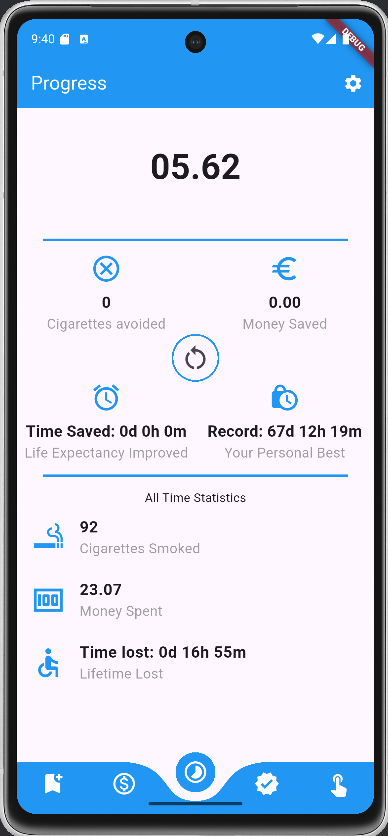
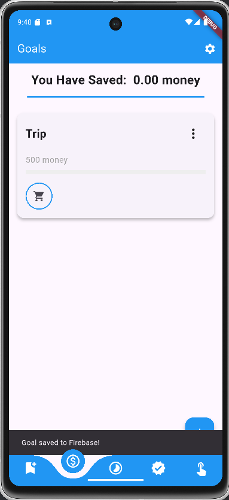
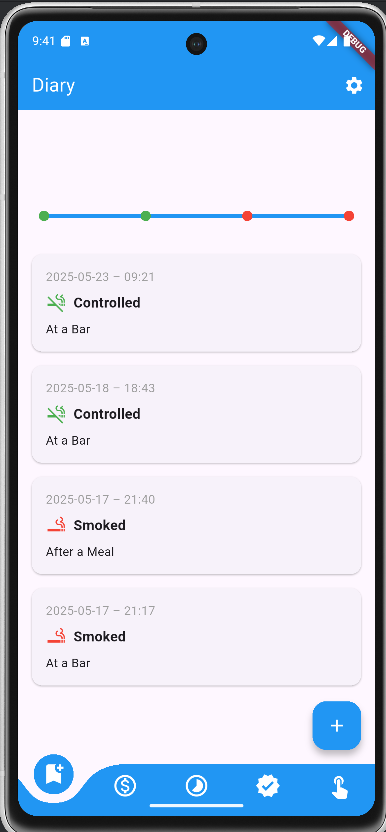
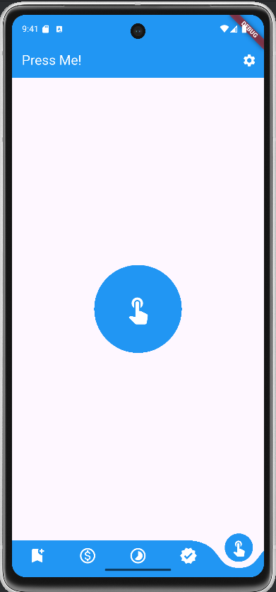

# fuma_free

A Flutter app with Firebase integration, developed as part of a **Mobile Programming** course at university. The goal is to help users track and reduce their smoking habits through awareness, journaling.

---

## Application Status

 **This project is currently unfinished.**

### Known Issues and Limitations

- Incomplete logic and inconsistent behavior across features  
- Inefficient Firebase usage with redundant calls  
- Authentication and per-user data separation as well as onboarding not implemented  
- No error handling for database connection failures  
- UI may overflow with large datasets or long text entries  

---

## Walkthrough

### Home Page – Progress

The main screen shows:

- Current **time since last cigarette**
- **Current run statistics**
- **All-time statistics**
- A **reset button** to restart tracking

---

### Goals Page

Users can create and delete personal goals to stay motivated and keep their progress intentional.

---

### Diary Page

Users can log moments when:

- They **smoke**
- They **resist the urge to smoke**

This helps identify behavior patterns and triggers.

---

### Distract Page

Includes a button that **grows and shrinks** on tap, acting as a **simple distraction tool** when a craving hits.

---

